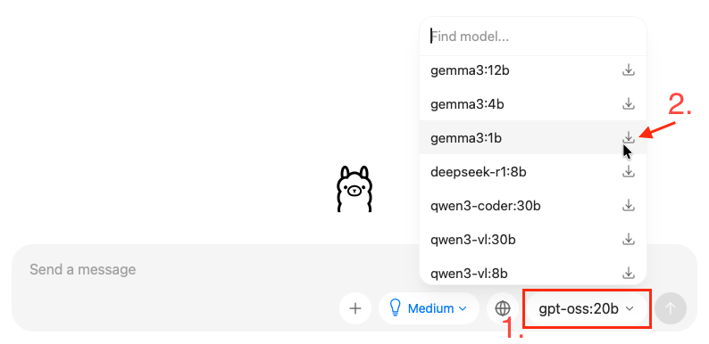

# ASIMOV Ollama Module

[](https://unlicense.org)
[](https://crates.io/crates/asimov-ollama-module)
[](https://docs.rs/asimov-ollama-module)

[ASIMOV] Ollama module.

## ✨ Features

- To be determined!

## 🛠️ Prerequisites

- [Rust] 1.85+ (2024 edition) if building from source code
- An available [Ollama](https://github.com/ollama/ollama) endpoint.

## ⬇️ Installation

### Installation with [ASIMOV CLI]

```bash
asimov module install ollama -v
```

### Installation from Source Code

```bash
cargo install asimov-ollama-module
```

## ⚙ Setup

This module uses an Ollama endpoint to generate responses.
On macOS a simple approach to run Ollama locally is:

```console
$ brew install ollama
$ brew services start ollama  # Start the service formula immediately and register it to launch at login (or boot).
```

Then you should be able to use `asimov-ollama-prompter`.
Alternatively downloading and running [the application](https://ollama.com/download) should also work.

### Downloading Models

You can download [a model](https://ollama.com/search) either through the CLI:

```console
$ ollama pull gemma3:1b
```

Or in the application:



## 👉 Examples

```console
$ echo "In two sentences, why is the sky blue?" | asimov-ollama-prompter -m gemma3:1b
The sky appears blue because of a phenomenon called Rayleigh scattering, where sunlight is split into different colors of light. Blue light is scattered more effectively by the tiny particles in the atmosphere than other colors, making it visible to our eyes.
```

## ⚙ Configuration

Provide a model name either by module configuration

```bash
asimov module config ollama
```

Or through environment variables

```bash
export ASIMOV_OLLAMA_MODEL="..."
```

### Optional configuration

| Name       | Environment Variable         | Default                  |
| ---------- | ---------------------------- | ------------------------ |
| `endpoint` | `ASIMOV_OLLAMA_API_ENDPOINT` | `http://localhost:11434` |

## 📚 Reference

### Prompt

```bash
echo "Why is the sky blue?" | asimov-ollama-prompter
```

## 👨‍💻 Development

```bash
git clone https://github.com/asimov-modules/asimov-ollama-module.git
```

---

[](https://x.com/intent/post?url=https://github.com/asimov-modules/asimov-ollama-module&text=asimov-ollama-module)
[](https://reddit.com/submit?url=https://github.com/asimov-modules/asimov-ollama-module&title=asimov-ollama-module)
[](https://news.ycombinator.com/submitlink?u=https://github.com/asimov-modules/asimov-ollama-module&t=asimov-ollama-module)
[](https://www.facebook.com/sharer/sharer.php?u=https://github.com/asimov-modules/asimov-ollama-module)
[](https://www.linkedin.com/sharing/share-offsite/?url=https://github.com/asimov-modules/asimov-ollama-module)

[ASIMOV]: https://asimov.sh
[ASIMOV CLI]: https://cli.asimov.sh
[JSON-LD]: https://json-ld.org
[KNOW]: https://know.dev
[RDF]: https://www.w3.org/TR/rdf12-primer/
[Rust]: https://rust-lang.org
